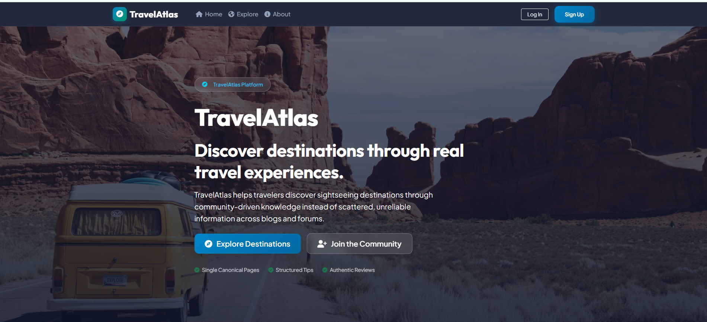
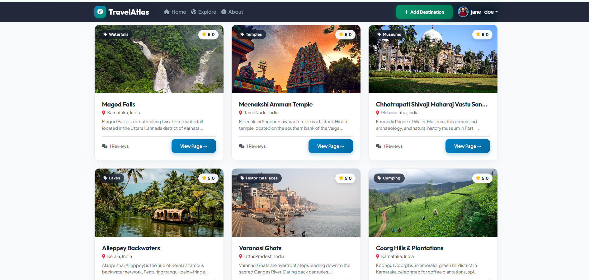
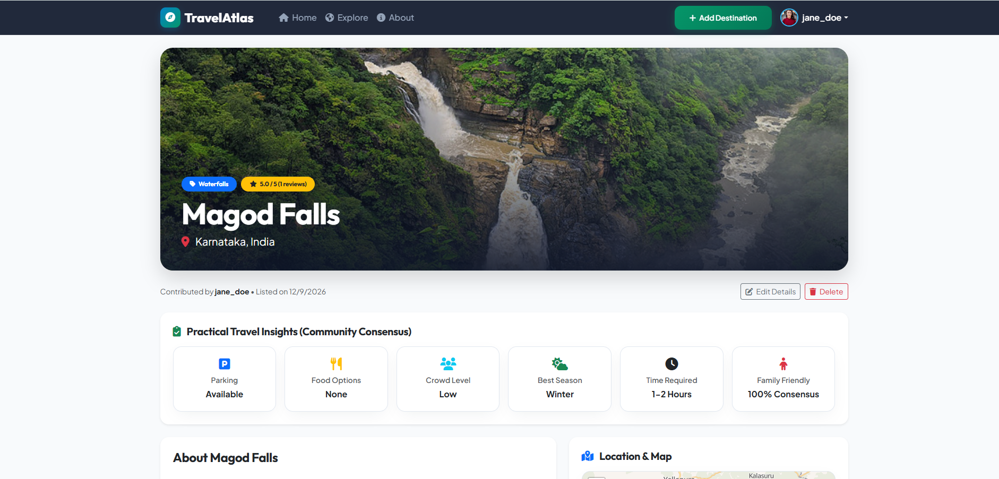
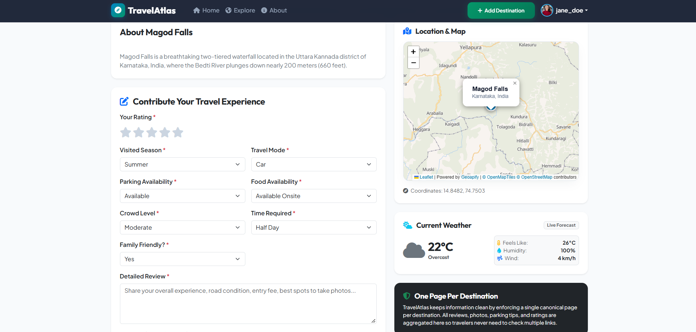
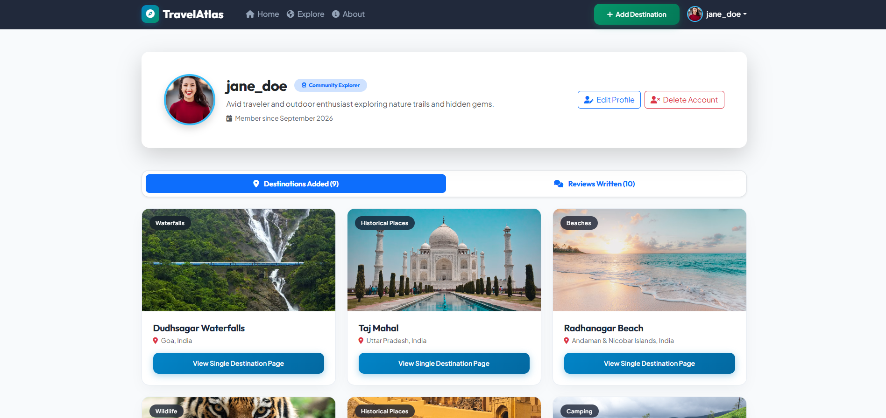
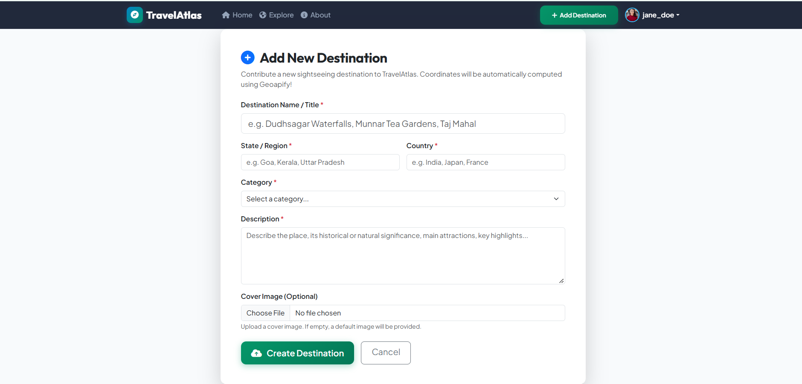
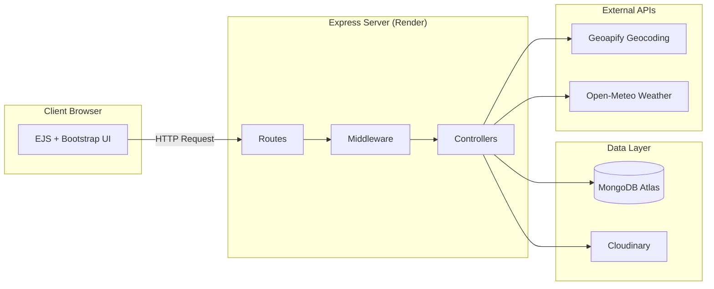
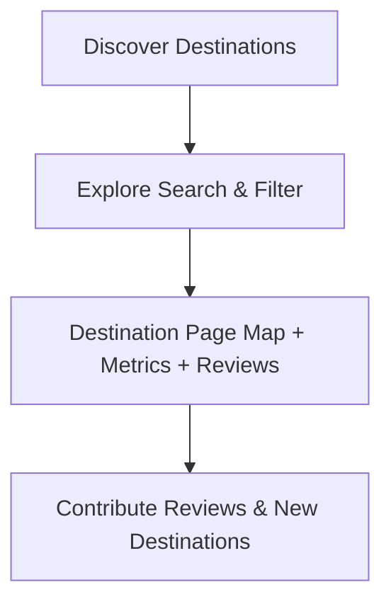

# 🌍 TravelAtlas

> **A Community-Driven Travel Knowledge Platform** for discovering destinations, exploring practical travel insights, and sharing experiences through structured community reviews.

[](https://nodejs.org/)
[](https://www.mongodb.com/atlas)
[](https://ejs.co/)
[](https://getbootstrap.com/)
[](https://render.com/)

**[🌐 Live Demo](https://travel-atlas.onrender.com)**

---

## 📌 Overview

Planning a trip often means searching through travel blogs, social media, maps, and forums to find practical information about a destination.

**TravelAtlas** brings this information together into a centralized platform where each destination has a dedicated page containing community-driven travel insights, ratings, practical metrics, images, and location information.

The platform focuses on making destination information easier to discover, compare, and contribute to.

---

## 💡 Why TravelAtlas?

Travel information today is scattered across blogs, social media, forums, and maps. A traveler planning a trip often has to open several tabs just to answer simple questions like:

- Is this place crowded?
- Is parking available?
- What's the best season to visit?
- Is it family-friendly?

**TravelAtlas** solves this by creating a **single canonical page for each destination** where practical, community-driven insights live together — not scattered across the internet.

---

## 📸 Screenshots

### 🏠 Landing Page

The TravelAtlas landing page introduces the platform and provides quick access to destination discovery and community participation.



---

### 🌍 Explore Destinations

Browse destinations through a centralized catalog with destination categories, ratings, locations, reviews, and quick access to individual destination pages.



---

### 📍 Destination Details

Each destination has a single dedicated page containing its core information, rating, category, location, and community-driven travel insights.



---

### 🤝 Community Insights, Map & Weather

The destination page brings together practical travel information, an interactive map, live weather information, and a form for users to contribute their own travel experiences.



---

### 👤 User Profile

Users can manage their profiles and view destinations they have added and reviews they have written.



---

### ➕ Add a Destination

Authenticated users can contribute new sightseeing destinations to the TravelAtlas community.



---

## ✨ Key Features

* **🗺️ Destination Discovery** — Browse and explore destinations through a centralized catalog.
* **🔎 Search & Filtering** — Search destinations and filter them by categories and location.
* **📍 Interactive Maps** — View destination locations using Leaflet.js with Geoapify-based geocoding.
* **⭐ Reviews & Ratings** — Share experiences, ratings, and practical travel tips.
* **📊 Travel Metrics** — Community-driven information such as crowd levels, parking availability, visiting season, and family-friendliness.
* **🌦️ Live Weather Information** — View destination-specific current weather information including temperature, feels-like temperature, humidity, wind speed, and weather conditions using the Open-Meteo API.
* **👤 User Authentication & Profiles** — User registration, login, profile management, and contribution tracking.
* **🖼️ Image Uploads** — Upload destination and review images using Cloudinary.
* **🛡️ Security & Validation** — Authentication, request validation, rate limiting, security headers, and input sanitization.
* **🔄 Duplicate Prevention** — Helps prevent duplicate destination entries and keeps destination information centralized.
* **📱 Responsive UI** — Built with Bootstrap and custom CSS for responsive usage across devices.

---

## 🛠️ Tech Stack

| Category       | Technologies                                       |
| -------------- | -------------------------------------------------- |
| Backend        | Node.js, Express.js                                |
| Templating     | EJS, EJS-Mate                                      |
| Frontend       | Bootstrap 5, Custom CSS, JavaScript                |
| Database       | MongoDB Atlas, Mongoose                            |
| Authentication | Passport.js, Passport-Local-Mongoose               |
| Maps           | Leaflet.js                                         |
| Geocoding      | Geoapify API, Axios                                |
| Weather API    | Open-Meteo API                                     |
| Image Storage  | Cloudinary, Multer                                 |
| Security       | Helmet, express-mongo-sanitize, express-rate-limit |
| Deployment     | Render                                             |

---

## 🏗️ System Architecture



---

## 🔄 How It Works



- **Discover** — Browse destinations through the main catalog.
- **Explore** — Search and filter destinations based on category or location.
- **View** — Open a destination page to see its details, map, travel metrics, ratings, and reviews.
- **Contribute** — Authenticated users can add destinations and share reviews and travel tips.
- **Consolidate** — Duplicate destination checks help keep information organized around a single destination page.

---

## 🌐 API References

| Service | Purpose | Type | Documentation |
| :--- | :--- | :--- | :--- |
| **[Geoapify Geocoding API](https://www.geoapify.com/geocoding-api)** | Forward & reverse geocoding for destination address resolution & duplicate detection | External REST API (API Key required) | [Geoapify Docs](https://apidocs.geoapify.com/) |
| **[Open-Meteo Weather API](https://open-meteo.com/)** | Live weather data (temperature, humidity, wind, conditions) by latitude & longitude | External REST API (No key required) | [Open-Meteo Docs](https://open-meteo.com/en/docs) |
| **[Cloudinary API](https://cloudinary.com/)** | Cloud storage, transformation, and delivery for destination & review image uploads | Cloud Media SDK / API | [Cloudinary Docs](https://cloudinary.com/documentation) |
| **[OpenStreetMap & Leaflet.js](https://leafletjs.com/)** | Map tile layers and client-side interactive map visualization | Frontend Library & Tile Provider | [Leaflet Docs](https://leafletjs.com/reference.html) |

---

## 📁 Project Structure

```text
TravelAtlas/
├── config/         # Database and Cloudinary configuration
├── controllers/    # Application logic
├── middleware/     # Authentication, security and validation middleware
├── models/         # Mongoose schemas
├── public/         # CSS, JavaScript and static assets
├── routes/         # Express route modules
├── utils/          # Error handling, geocoding, weather and utilities
├── views/          # EJS templates, layouts and partials
├── screenshots/    # README project screenshots
│
├── app.js          # Main Express application
├── seed.js         # Initial database seed script
├── package.json    # Dependencies and project scripts
└── .env.example    # Environment variable template
```

---

## 🗄️ Database

TravelAtlas uses MongoDB Atlas as its persistent database with Mongoose for data modeling and database interaction.

The application stores its core application data in MongoDB Atlas, including destination, user, and review-related data.

The project also includes a `seed.js` script for populating the database with initial destination data.

---

## ⚙️ Environment Configuration

TravelAtlas uses environment variables for external services and application configuration, including:

- MongoDB Atlas
- Session secret
- Cloudinary
- Geoapify
- Open-Meteo weather service configuration, where applicable

---

A `.env` file is used for local development, while production configuration is managed through the deployment environment.

## 🚀 Getting Started Locally

### Prerequisites

- Node.js (v18.x or newer)
- MongoDB Atlas account (or local MongoDB instance)
- Cloudinary account
- Geoapify API key

### Setup

1. **Clone the repository**
   ```bash
   git clone https://github.com/yourusername/travel-atlas.git
   cd travel-atlas
   ```

2. **Install dependencies**
   ```bash
   npm install
   ```

3. **Create `.env` file in the root directory**
   ```env
   PORT=3000
   MONGO_URI=your_mongodb_atlas_uri
   SESSION_SECRET=your_session_secret
   CLOUDINARY_CLOUD_NAME=your_cloud_name
   CLOUDINARY_KEY=your_cloudinary_key
   CLOUDINARY_SECRET=your_cloudinary_secret
   GEOAPIFY_API_KEY=your_geoapify_key
   ```

4. **Seed the database (optional)**
   ```bash
   node seed.js
   ```

5. **Start the server**
   ```bash
   npm start
   ```

6. **Open in browser**
   ```
   http://localhost:3000
   ```

---

## 👥 Demo Credentials

If you've seeded the database, you can use the following test account:

| Role | Email | Password |
| :--- | :--- | :--- |
| Test User | `demo@travelatlas.com` | `Demo@123` |

> 🔒 **Note:** Public registration creates a standard user account. Users can contribute destinations and reviews after logging in.

---

## 🔐 Security

TravelAtlas incorporates several security and validation measures, including:

- Authentication and authorization
- Request validation
- Input sanitization
- Secure HTTP headers using Helmet
- Rate limiting
- MongoDB query sanitization
- Environment-based secret management
- Server-side handling of external API requests

---

## 🧠 Key Technical Decisions

- **Duplicate Prevention** — Geocoding-based deduplication ensures each destination is represented by a single canonical page.
- **Server-Side API Calls** — External API requests (weather, geocoding) are handled on the backend to keep API keys secure.
- **Community-Driven Metrics** — Practical travel metrics (crowd levels, parking, seasonality) are contributed by users, making the platform genuinely useful for trip planning.
- **Security-First Approach** — Multiple layers of protection (Helmet, rate limiting, sanitization, validation) are applied to protect against common web vulnerabilities.

---

## 👥 Community-Driven Approach

TravelAtlas is designed around the idea of bringing practical travel knowledge together on a single canonical page for each destination.

Instead of requiring travelers to search through multiple sources for different pieces of information, a destination page brings together:

- Destination information
- Community ratings
- Practical travel metrics
- Travel experiences
- Location information
- Interactive maps
- Current weather information
- Images

This allows travelers to discover destinations and access practical community knowledge in one place.

---

## 🚀 Deployment

TravelAtlas is deployed as a Node.js web service on Render and uses MongoDB Atlas for persistent database storage.

The application is configured to use environment variables for production services and credentials.

**Live Demo:** [https://travel-atlas.onrender.com](https://travel-atlas.onrender.com)
